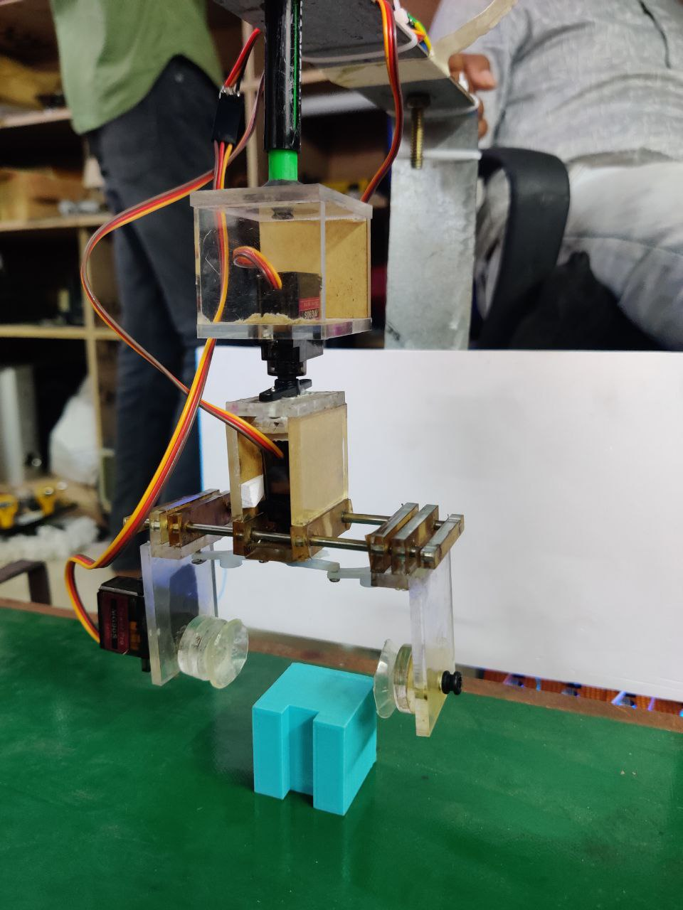

# Automate-Object-orientation-system

## Overview
The Automated Object Orientation System is a project aimed at automating the orientation of objects on a conveyor belt using computer vision and robotic manipulation techniques. The system detects objects, classifies their orientation, and commands a robotic arm to correct any misalignment, ensuring smooth industrial processes.

## Features
- Object detection and classification using TensorFlow and OpenCV.
- Integration of an Arduino-controlled robotic arm for automated object manipulation.
- Real-time communication between Python and Arduino for seamless control.

## Hardware Components
- Custom robotic arm with:
  - 3 servomotors
  - 1 DC motor
- Arduino microcontroller

